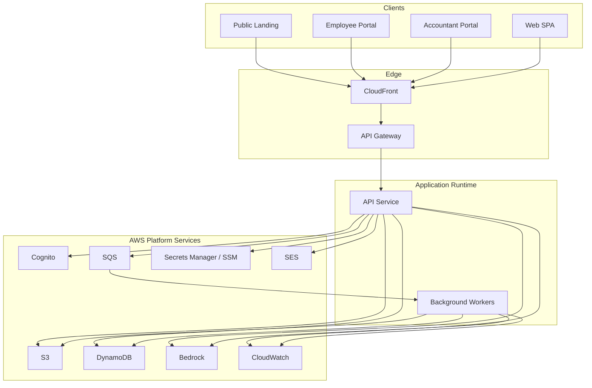
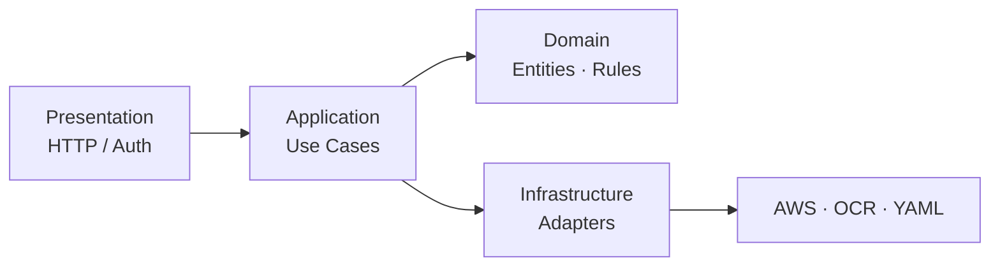
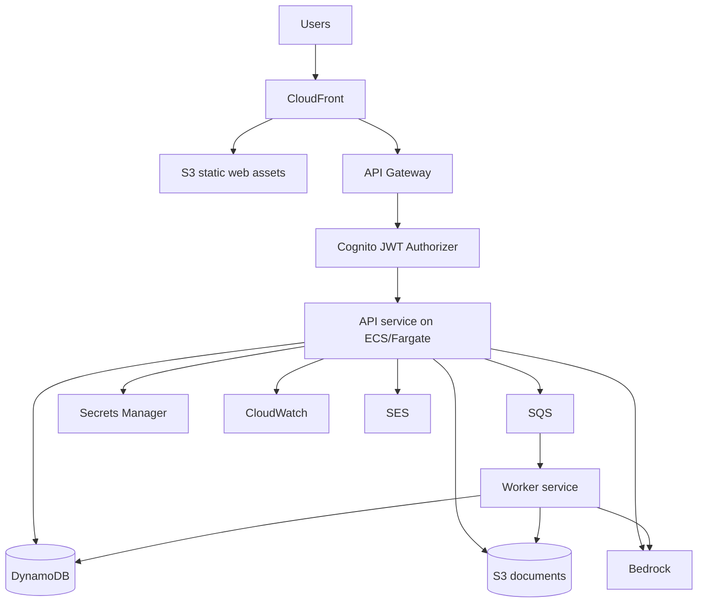
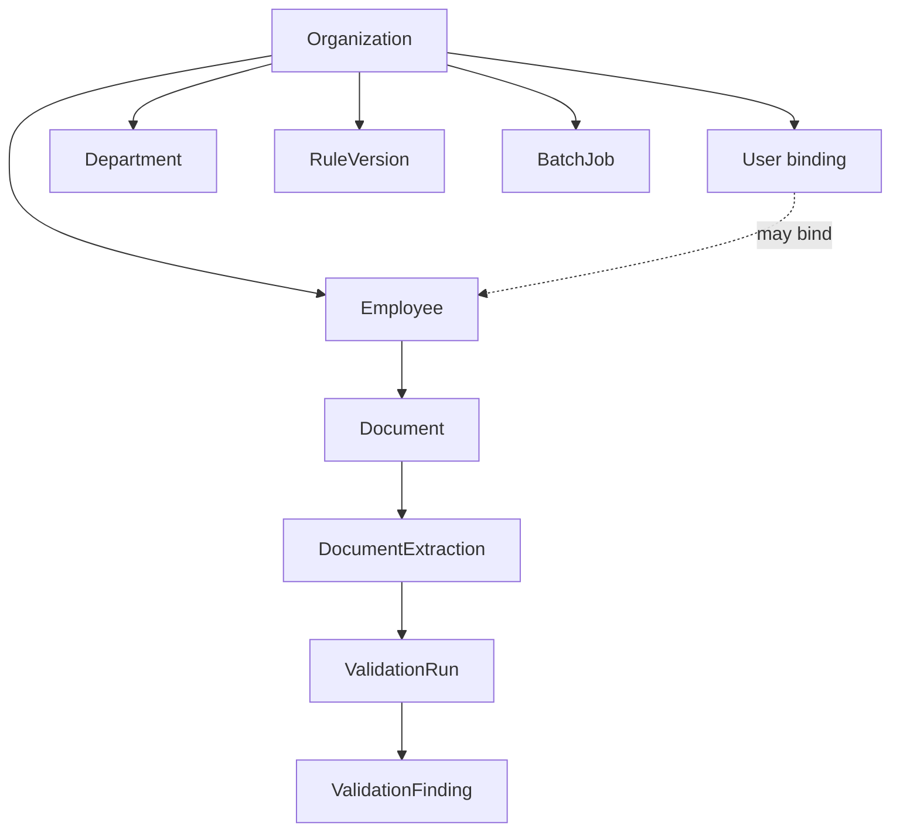
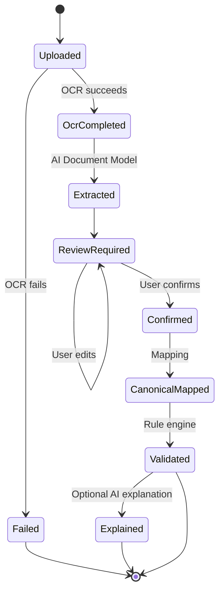
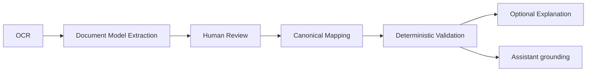

# Payroll Copilot — System Architecture

**Document status:** Source of truth for system architecture  
**Audience:** Senior engineers, tech leads, security reviewers  
**Scope:** Product architecture and production target (AWS). Implementation details live in code and module READMEs.

This document describes **what the system is**, **how responsibilities are bounded**, and **where they live** in production. It is intended to evolve with the product. When code and this document diverge, update this document in the same change set whenever architecture decisions change.

---

## 1. Project Vision

Payroll Copilot is a multi-tenant payroll validation platform focused on **Israeli labor-law compliance**.

### Product goals

- Allow guests and authenticated employees to upload payslips and receive **deterministic**, auditable validation results.
- Assist users with payroll and labor-law questions using **approved, source-bound** content—not free-form legal invention.
- Enable payroll accountants to manage employees, rules, bulk document intake, and review queues.
- Keep **compliance pass/fail decisions** under a deterministic rule engine. AI augments extraction, explanation, and assistance; it never owns compliance outcomes.

### Non-goals (current architecture horizon)

- Replacing certified payroll calculation engines.
- Unbounded generative legal advice disconnected from approved rule corpora.
- Premature microservices for every bounded context.

### Architectural north star

> **Deterministic validation is the product core. AI and cloud services are interchangeable adapters around stable domain boundaries.**

---

## 2. High-Level Architecture

Payroll Copilot ships as a **modular monolith**: one primary API application with strict internal layers, plus a single-page web client. Background work runs as workers consuming queues. Cloud services provide identity, storage, AI inference, secrets, and observability.

**Persistence posture:** Amazon DynamoDB is the **primary business database**. Amazon S3 holds all document bytes. There is no relational primary store in the production architecture.



### Internal layering (Clean Architecture)



| Layer | Responsibility |
| --- | --- |
| **Presentation** | HTTP contracts, auth principal resolution, request validation, i18n headers |
| **Application** | Use cases, orchestration, ports (interfaces), mapping between document and canonical models |
| **Domain** | Entities, value objects, validation semantics, rule interfaces |
| **Infrastructure** | DynamoDB adapters, S3, AI providers, OCR, queues, secrets |

### Primary user journeys

| Journey | Summary |
| --- | --- |
| **Guest landing** | Upload → OCR → complete Document Model → review → confirm → canonical mapping → deterministic validation → optional AI explanation |
| **Employee** | Authenticated upload → extract → identity/period trust checks → confirm → owned validation |
| **Accountant** | Employee master data, rule versioning, bulk intake, progress, manual review, audit |
| **Assistant** | Source-bound Q&A over approved labor-law content and existing validation findings |

---

## 3. Technology Stack

### Client

| Concern | Choice | Notes |
| --- | --- | --- |
| UI | React SPA | Role-based portals + public landing |
| Routing | Client-side router | Public vs employee / accountant / admin |
| i18n | Locale packs | Hebrew, English, Arabic; RTL-aware |
| API access | HTTPS JSON | Bearer tokens from Cognito |

### Application runtime

| Concern | Choice | Notes |
| --- | --- | --- |
| API | FastAPI-style modular service | Sync request path for interactive flows |
| Workers | Queue consumers | Batch OCR, splitting, long-running AI |
| Rules | Versioned rule packs + domain evaluators | Authoritative for labor-law packs |
| Validation | Deterministic Python rule engine | No LLM in pass/fail path |

### Data and platform

| Concern | Production choice | Role |
| --- | --- | --- |
| Business data | Amazon DynamoDB | Primary store: org, employees, documents metadata, extractions, validation, audit, sessions, jobs |
| Objects | Amazon S3 | All document bytes, exports, optional rule-pack artifacts, static web assets |
| Identity | Amazon Cognito | Users, sessions, MFA-ready identity |
| Authorization | Backend application layer | Fine-grained org, binding, and action checks |
| AI inference | Amazon Bedrock | Extraction, explanation, assistant generation |
| Secrets / config | Secrets Manager + SSM Parameter Store | Credentials and non-secret parameters |
| Async | Amazon SQS (+ optional Step Functions) | Batch and fan-out workflows |
| Email | Amazon SES | Notifications and accountant alerts |
| Observability | CloudWatch (+ optional X-Ray) | Logs, metrics, traces |

### Local development parity

Local stacks may substitute MinIO for S3, DynamoDB Local / embedded substitutes for DynamoDB, local queues for SQS, and a local LLM for Bedrock. **Production architecture assumes AWS service boundaries**, not local substitutes.

---

## 4. AWS Infrastructure

### Logical environments

| Environment | Purpose |
| --- | --- |
| `dev` | Feature development, relaxed guards where safe |
| `staging` | Production-like integration and load rehearsal |
| `prod` | Customer traffic |

Each environment has isolated Cognito user pools (or clearly separated app clients), S3 buckets, DynamoDB tables, and IAM roles.

### Core topology



### Service ownership

| AWS service | Owns |
| --- | --- |
| Cognito | Identity lifecycle, tokens, password/MFA policies |
| API Gateway / ALB | Ingress, TLS termination, WAF hooks, throttling |
| ECS/Fargate (or equivalent) | API and worker processes |
| DynamoDB | Primary business persistence (single-table design) |
| S3 | All document objects and static web assets |
| Bedrock | Model inference only |
| SQS / Step Functions | Asynchronous orchestration |
| IAM | Least-privilege roles for API, workers, and CI |
| CloudWatch | Operational telemetry |
| SES | Outbound notifications |

### Multi-tenancy

- Every durable business item is scoped by **organization** in its partition key (or an equivalent tenant prefix).
- S3 object keys embed organization identity.
- Authorization always re-checks organization membership in the **backend**; Cognito groups alone are not sufficient for payroll data access.

---

## 5. Authentication

### Principles

- Production authentication is **Amazon Cognito**.
- The API trusts verified JWT claims (issuer, audience, expiry, signature).
- The SPA never stores long-lived secrets; it stores tokens according to agreed browser security practice for the chosen Cognito app client model.
- Guest access is an explicit product mode with **short-lived** credentials and hard TTL, not an anonymous free-for-all.

### Actors

| Actor | How they authenticate |
| --- | --- |
| Guest | Short-lived guest session token (Cognito unauthenticated / custom guest flow or equivalent short-lived issued token with TTL) |
| Employee | Cognito user in employee group, bound to an employee record |
| Payroll accountant | Cognito user in accountant group |
| Developer admin | Cognito user in admin group (elevated, audited) |
| System integrations | Machine credentials (IAM or API keys) for webhooks only |

### Token model

- Access tokens authorize API calls.
- Refresh tokens (where enabled) rotate under Cognito policy.
- Guest tokens cannot access employee-bound or accountant mutation routes.
- Employee tokens must resolve to a **bound employee** before payslip trust operations.

### Session boundaries

| Session type | Lifetime intent | Persistence |
| --- | --- | --- |
| Guest interactive session | Hours or less | DynamoDB item(s) with TTL |
| Authenticated user session | Cognito-managed | Cognito (+ optional profile mirror item in DynamoDB) |
| Batch job context | Job duration | DynamoDB job / stage items |

---

## 6. Authorization

Authentication answers *who*. Authorization answers *what they may do*.

### Model

Authorization is performed in the **backend**, after Cognito has authenticated the caller.

1. **Role** from identity (employee, payroll_accountant, developer_admin, guest).
2. **Organization scope** on every data access.
3. **Resource binding** (e.g., Cognito subject ↔ employee) for employee-owned documents and validations.
4. **Action policy** in the application layer (upload, confirm, validate, edit rules, approve diffs).

### Role capabilities (summary)

| Capability | Guest | Employee | Accountant | Admin |
| --- | --- | --- | --- | --- |
| Upload payslip for ephemeral review | Yes | Yes (owned) | Yes (bulk/org) | Limited / ops |
| Confirm extraction | Yes (guest session) | Yes (owned) | Review flows | Ops |
| Run deterministic validation | Yes (scoped) | Yes (owned) | Yes (org) | Ops |
| Mutate employee master data | No | No | Yes | Yes |
| Edit / version payroll rules | No | No | Yes | Yes |
| Manage users / system config | No | No | No | Yes |
| Access other employees’ PII | No | No | Yes (org, audited) | Yes (audited) |

### Enforcement points

- Edge: Cognito JWT presence and coarse group checks.
- Backend API: fine-grained checks in use cases and security dependencies.
- Data: organization-prefixed keys in DynamoDB and S3; repositories never return cross-tenant items.

### Auditability

Sensitive authorization outcomes (denied access to PII, rule publish, bulk download) emit audit items in DynamoDB.

---

## 7. DynamoDB Architecture

Amazon DynamoDB is the **primary business database**. The production design follows a **Single Table Design** philosophy: one main application table (per environment) holds multiple entity types, shaped by **access patterns**, not by relational tables.

### Design rules

- Prefer **one application table** (`PayrollCopilot`) per environment; add a second table only when isolation or scaling clearly requires it.
- Every item has `PK` and `SK` (and usually `entity_type`, `organization_id`, `updated_at`).
- Model **queries first**; entity shapes follow access patterns.
- Use sparse GSIs for alternate lookups (national ID, email, job status, period).
- Use DynamoDB **TTL** for guest sessions and other ephemeral artifacts.
- Keep large payloads (full Document Models, OCR dumps) in **S3** when item size or churn warrants it; store pointers on the item.
- Conditional writes enforce uniqueness where required (e.g., one confirmed payslip version per employee period).

### Key conventions

| Key | Convention | Example |
| --- | --- | --- |
| `PK` | Tenant + entity family | `ORG#<orgId>` or `ORG#<orgId>#EMP#<employeeId>` |
| `SK` | Entity discriminator + natural id | `EMP#<employeeId>`, `DOC#PAYSLIP#2026-07#<docId>`, `VALRUN#<runId>` |
| `GSI1PK` / `GSI1SK` | Alternate access path | National ID lookup, Cognito subject → employee |
| `entity_type` | Stable type string | `employee`, `document`, `validation_run`, `guest_session` |
| `ttl` | Epoch expiry | Guest sessions only |

### Core item families (illustrative)

| entity_type | PK | SK | Typical use |
| --- | --- | --- | --- |
| `organization` | `ORG#<orgId>` | `META` | Tenant settings |
| `employee` | `ORG#<orgId>` | `EMP#<employeeId>` | Master data; list employees under org |
| `user_binding` | `ORG#<orgId>` | `USER#<cognitoSub>` | Map identity → employee / role mirror |
| `document` | `ORG#<orgId>#EMP#<employeeId>` | `DOC#<type>#<period>#<docId>` | Metadata + S3 key |
| `extraction` | `ORG#<orgId>#EMP#<employeeId>` | `EXT#<docId>#v<version>` | Versioned extraction / confirmation |
| `validation_run` | `ORG#<orgId>#EMP#<employeeId>` | `VALRUN#<runId>` | Run summary |
| `validation_finding` | `ORG#<orgId>#EMP#<employeeId>` | `VALFIND#<runId>#<findingId>` | Individual findings |
| `rule_version` | `ORG#<orgId>` | `RULE#<pack>#v<version>` | Versioned rule packs |
| `batch_job` | `ORG#<orgId>` | `JOB#<jobId>` | Bulk intake job |
| `job_stage` | `ORG#<orgId>#JOB#<jobId>` | `STAGE#<name>` | Stage progress |
| `manual_review` | `ORG#<orgId>` | `REVIEW#<itemId>` | Low-confidence queue |
| `audit_event` | `ORG#<orgId>` | `AUDIT#<timestamp>#<id>` | Sensitive actions |
| `guest_session` | `GUEST#<sessionId>` | `META` / `STATE` | Ephemeral guest flow (TTL) |

Exact key strings may evolve; the **access patterns** in §9 are authoritative.

### GSIs (minimal set)

| Index | Purpose |
| --- | --- |
| **GSI1** | Lookup by Cognito subject → org / employee binding |
| **GSI2** | Lookup by national ID (hashed/encrypted form as designed) within org |
| **GSI3** | Optional: jobs or review items by status for accountant queues |

Add indexes only when a product access pattern requires them.

### Consistency and multi-item writes

- Prefer designing aggregates so a primary write is a single item or a small **TransactWriteItems** set (document metadata + current extraction pointer).
- Do not simulate arbitrary relational joins; denormalize summary fields onto parent items when list screens need them (e.g., latest validation status on the employee or period item).

---

## 8. Entity Model

The conceptual model spans **Document Model** (extraction) and **Canonical Payroll Model** (validation), plus organizational master data. In persistence terms, entities are **item collections** addressed by access patterns—not normalized relational tables.

### Domain relationships (logical)



### Core entities

| Entity | Meaning | Persistence sketch |
| --- | --- | --- |
| **Organization** | Tenant boundary | `ORG#… / META` |
| **User binding** | Link from Cognito subject to org role / employee | `ORG#… / USER#…` + GSI by subject |
| **Employee** | Business person record | `ORG#… / EMP#…` |
| **Department** | Org unit with rule profile | `ORG#… / DEPT#…` |
| **Document** | Artifact metadata (type, period, owner, S3 key, lifecycle) | Under employee or batch PK |
| **DocumentExtraction** | Versioned extraction + confirmation state | Adjacent SK under same employee prefix |
| **ValidationRun** | One rule-engine execution | Adjacent SK; findings as child items or embedded summary |
| **ValidationFinding** | Individual deterministic finding | Child items under run or compact list on run item |
| **RuleVersion** | Versioned rule pack reference + audit | Under org PK |
| **BatchJob** | Bulk PDF intake + stages | Job + stage items |
| **AuditEvent** | Immutable sensitive-action record | Append-only under org PK |
| **GuestSession** | Ephemeral guest Document Model lifecycle | `GUEST#…` with TTL |

### Document Model vs Canonical Payroll Model

| Model | Role |
| --- | --- |
| **Document Model** | Faithful structured reconstruction of the uploaded slip: dynamic keys/values, sections, table cell relationships. Source of truth for user review. |
| **Canonical Payroll Model** | Fixed internal field set required by validation. Produced **after** confirmation by mapping. |

Validation consumes **only** the Canonical Payroll Model. The Document Model may grow freely without changing the rule engine. Large Document Models may live in S3 with a DynamoDB pointer.

---

## 9. Access Patterns

Architecture is driven by how the product reads and writes data. DynamoDB keys and GSIs exist to serve these patterns.

### Interactive guest

| Access pattern | Approach |
| --- | --- |
| Create guest session | Put `GUEST#session / META` with TTL |
| Store / update Document Model | Update session item or write S3 object + pointer |
| Confirm → canonical snapshot | Conditional update on session state |
| Run validation | Read canonical snapshot; optionally write ephemeral or durable run items per policy |
| Expire abandoned sessions | DynamoDB TTL |

### Authenticated employee

| Access pattern | Approach |
| --- | --- |
| Resolve Cognito subject → employee | GSI1 on user binding |
| Upload payslip for period | Put S3 object; put `DOC#…` item; conditional uniqueness on period |
| List months / documents for employee | Query `PK = ORG#…#EMP#…`, `SK begins_with DOC#` |
| Load extraction / confirmation | Get / query `EXT#…` under employee prefix |
| Compare identity / period | Get employee item + current extraction |
| Validation history | Query `VALRUN#` under employee prefix |

### Accountant

| Access pattern | Approach |
| --- | --- |
| List / search employees | Query `PK = ORG#…`, `SK begins_with EMP#` (+ optional filter/search index later) |
| Edit employee profile | Update employee item + audit event |
| Browse / edit rules with rollback | Query `RULE#` versions; write new version item (immutable history) |
| Start bulk PDF job | Put job item; enqueue SQS; write stage items as workers progress |
| Poll stage progress | Query `ORG#…#JOB#…` / `STAGE#…` |
| Manual review queue | Query `REVIEW#` (optionally via status GSI) |
| Org audit trail | Query `AUDIT#` under org (time-sorted SK) |

### Assistant

| Access pattern | Approach |
| --- | --- |
| Keyword / retrieval over approved rules | Rule pack items and/or S3 artifacts; future retrieval index remains an extension |
| Explain existing finding | Get finding / run items; call Bedrock for non-decisive explanation |

---

## 10. Document Lifecycle



### Lifecycle stages

1. **Upload** — Guardrails (type, size, malware policy as applicable); store **all** document bytes in S3; write metadata item in DynamoDB (or guest session item).
2. **OCR** — Produce page text and confidence signals; store evidence inline or in S3.
3. **Extraction** — Build complete Document Model (sections, fields, tables). No fixed payroll schema filtering.
4. **Review** — User edits keys/values; may add/delete rows. No requirement to edit before confirm.
5. **Confirm** — Freeze reviewed Document Model; run canonical mapping; persist confirmation state.
6. **Validate** — Deterministic engine over Canonical Payroll Model; persist run and findings.
7. **Explain (optional)** — AI explains findings; cannot change outcomes.
8. **Retain or expire** — Guest TTL vs employee/org retention policy on DynamoDB items and S3 lifecycle rules.

### Trust boundaries

- Employee uploads: identity and payroll-period mismatch can **block** confirmation or validation.
- Guest uploads: no employee master match; validation scope is explicitly limited and disclosed in the UI.

---

## 11. S3 Storage Structure

S3 holds **all** document bytes and static web assets. Business metadata and authorization live in DynamoDB and the backend.

### Bucket separation

| Bucket purpose | Contents |
| --- | --- |
| Web assets | Built SPA |
| Documents | Payslips, attendance, contracts, IDs, bulk PDFs, guest objects as required |
| Exports / reports | Generated accountant exports (optional) |
| Artifacts | Rule packs, prompt bundles (optional) |

### Key layout (documents)

```text
org/{organization_id}/
  employees/{employee_id}/
    payslips/{year}/{month}/v{version}/{document_id}.pdf
    attendance/...
    contracts/...
    identity/...
  batches/{batch_job_id}/
    source/{filename}
    splits/{slip_index}/{document_id}.pdf
  guest/{guest_session_id}/
    {document_id}.pdf
```

### Object rules

- Server-side encryption (SSE-S3 or SSE-KMS).
- Block public access; access via short-lived presigned URLs or authenticated API streaming.
- Versioning enabled on document buckets.
- Lifecycle policies for incomplete multipart uploads, guest expiry alignment, and optional tiering.
- DynamoDB document items store the canonical object key (and optional content hash).

---

## 12. AI Architecture

AI is an **adapter layer**. Domain validation does not call models.



### Responsibilities

| Capability | AI role | Deterministic role |
| --- | --- | --- |
| OCR | Optional assistive cleanup | Text/layout providers produce evidence |
| Document reconstruction | Primary | None |
| Canonical field selection | None | Synonym mapping after confirm |
| Pass/fail / severity | None | Rule engine |
| Finding explanation | Primary (optional) | Findings already exist |
| Assistant answers | Primary with guardrails | Approved corpus + tool constraints |

### Production inference

- **Amazon Bedrock** hosts extraction, explanation, and assistant generation models.
- Prompts and model IDs are configuration (SSM / config packs), not hard-wired business rules.
- Guardrails: input filtering, output constraints, refusal for out-of-scope legal inventiveness, locale-aware responses.

### Document-first extraction principle

The extractor reconstructs the uploaded document as completely as practical. Completeness outranks “important field” selection. Tables preserve row/column relationships in the Document Model. Unused fields are retained for future mapping and rules.

### Failure modes

- Model unavailable → fail the AI stage honestly; do not fabricate fields or findings.
- Low OCR quality → uncertain/missing values; user review remains available.
- Sparse extraction → product warning; validation may mark scopes unable to verify.

---

## 13. API Architecture

### Style

- Versioned HTTP JSON API (`/api/v1/...`).
- Resource-oriented routes for documents, extraction, validation, employees, batch, compliance, assistant.
- Idempotent confirms and explicit versioning for extractions where durability requires it.

### Surface areas

| Area | Intent |
| --- | --- |
| Auth | Cognito at the edge; backend resolves principal and bindings |
| Extraction | Guest and employee upload/extract/correct/confirm |
| Validation | Run and fetch deterministic results |
| Employees | Master data and employee profile aggregates |
| Documents | Metadata and authorized download (S3) |
| Batch | Job create/status for bulk PDFs |
| Manual review | Queue and resolve low-confidence items |
| Compliance | Rule packs, diff proposals, sync hooks |
| Assistant | Chat with guardrails and sources |
| Health | Liveness / readiness |

### Guest vs employee contracts

- Guest flows optimize for ephemeral Document Model review and limited validation scope.
- Employee flows add ownership, period uniqueness, and identity/period comparison results in responses.
- Additive fields (e.g., Document Model `section` metadata) must remain backward compatible.

### Error philosophy

- Stable machine `code` + human `message`.
- No silent success when OCR/AI/validation partially fails.
- Authorization failures do not leak existence of cross-tenant resources.

---

## 14. Repository Layer

Repositories are the **only** persistence boundary for application use cases.

### Principles

- Use cases depend on **ports** (interfaces), not the DynamoDB SDK or S3 APIs.
- Repositories are shaped by **aggregates and access patterns** (e.g., `EmployeeRepository`, `DocumentRepository`, `ExtractionRepository`, `ValidationRepository`, `GuestSessionRepository`, `BatchJobRepository`).
- Mapping between DynamoDB items and domain entities is isolated inside infrastructure adapters.
- Multi-item consistency uses conditional updates and, when required, DynamoDB transactions—not relational ACID assumptions.
- Document **bytes** always go through an object-storage port backed by S3.

### Store selection guidance

| Data | Store | Repository style |
| --- | --- | --- |
| Org, employees, bindings, documents metadata, extractions, validation, rules, audit, jobs | DynamoDB (single-table) | Entity / access-pattern repositories |
| Document bytes, large OCR / Document Model blobs | S3 | Object storage port |
| Auth credentials / sessions | Cognito | Identity provider (not a business repository) |
| Rule pack source artifacts (optional) | S3 (+ version items in DynamoDB) | Rules loader + version repository |

### Anti-patterns

- Calling Bedrock or S3 directly from route handlers without a use case.
- Embedding organization filters only in the UI.
- Writing validation findings from AI explanation paths.
- Introducing a second primary database for core business entities without an explicit architecture revision.

---

## 15. Security

### Data protection

- Encryption in transit (TLS) and at rest (DynamoDB, S3).
- Sensitive identifiers (e.g., national ID) stored encrypted or irreversibly keyed for lookup as required by policy.
- Least-privilege IAM roles for API vs workers vs CI (table- and prefix-scoped where practical).

### Application security

- Upload guardrails: content type, size limits, page limits.
- SSRF/path-traversal protection for fixture/dev tooling (never enabled in production).
- Output encoding and sanitized Markdown for assistant content in the client.
- CORS allowlists per environment.

### Privacy and tenancy

- Strict organization isolation via key design and backend checks.
- Guest data minimization and short TTL.
- Accountant access to PII is authenticated, authorized in the backend, and audited.

### Secrets

- No long-lived secrets in source control or client bundles.
- Runtime injection via Secrets Manager / SSM.
- Rotation supported for integration credentials.

---

## 16. Monitoring

### Signals

| Signal | Examples |
| --- | --- |
| **Logs** | Structured JSON: request id, org id, use case, stage timings, error codes |
| **Metrics** | Latency, error rate, OCR duration, extraction latency, validation duration, SQS depth, DynamoDB throttles, guest session count |
| **Traces** | Request → OCR → extraction → validate spans |
| **Alerts** | 5xx burn rate, Bedrock throttling, DLQ depth, DynamoDB throttle/user errors, auth failure spikes, SES bounce spikes |

### Product health KPIs

- Extraction success rate and sparse-document rate.
- Confirm-without-edit rate (sanity of Document Model quality).
- Validation completion vs unable-to-verify share.
- Batch stage skip/fail honesty (no false “completed”).

### Operational principles

- Prefer actionable alerts over noisy dashboards.
- Correlate guest session id / document id / validation run id across logs.
- AI failures are first-class metrics, not silent fallbacks that invent data.

---

## 17. Future Extensions

Designed extension points (no requirement that all exist today):

| Extension | Architectural hook |
| --- | --- |
| Vector RAG over contracts/policies | Retrieval port behind assistant/validation context builders; embeddings in a dedicated store or managed search—not a second business primary DB |
| Attendance / contract / national-ID analyzers | New document-type pipelines feeding canonical context fields |
| Historical payroll comparison | Employee-period item collections + dedicated rules module |
| MCP legal sync | Proposal-only workflow; human approval before rule pack mutation |
| In-app document viewer | Presigned S3 + overlay of extraction evidence coordinates |
| Step Functions for batch | Replace ad-hoc worker graphs with explicit state machines |
| Multi-region | Stateless API, global tables / regional stacks, regional Bedrock quotas |
| Fine-grained ABAC | Attribute policies on department/cost center in addition to roles |
| Additional GSIs | Only when a new access pattern is product-proven |

Extensions must preserve:

1. Deterministic validation authority.
2. Document Model vs Canonical Model separation.
3. Organization tenancy and auditability.
4. DynamoDB as the primary business database and S3 as document storage.

---

## 18. Design Principles

1. **Determinism over spectacle** — Compliance outcomes come from rules, not models.
2. **Document-first extraction** — Reconstruct the slip; map later.
3. **Confirm before canonicalize** — Humans review the Document Model before internal schema commitment.
4. **Ports over vendors** — Cognito, Bedrock, DynamoDB, S3 are adapters behind stable interfaces.
5. **Access patterns over tables** — DynamoDB keys follow queries; entities are item families.
6. **Single-table by default** — One application table per environment unless isolation demands otherwise.
7. **Modular monolith first** — Split services only when scaling, ownership, or failure isolation demands it.
8. **Tenant isolation always** — Organization id on every durable path.
9. **Honest partiality** — Prefer “unable to verify” over fabricated certainty.
10. **Additive APIs** — Prefer optional fields and new endpoints over breaking contracts.
11. **Audit sensitive mutations** — Rules, PII access, bulk exports, approvals.
12. **Security by default** — Short guest TTL, least privilege, encrypted secrets, no public document buckets.
13. **Observability as a feature** — Stage timings and failure codes are part of the product contract with operators.
14. **Evolve the architecture doc with the system** — Treat this file as living design authority.

---

## Document maintenance

| Change type | Update this document? |
| --- | --- |
| New AWS service adoption | Yes |
| New durable entity or access pattern | Yes |
| New DynamoDB GSI or key convention | Yes |
| New validation module (domain only) | Brief note under Future Extensions or Entity Model |
| Pure bugfix / refactors inside a boundary | No |
| Change to Document Model ↔ Canonical Model relationship | Yes |

**Related materials:** product README (status), `docs/` technical deep-dives, OpenAPI for endpoint specifics. When those conflict with this file on architectural intent, **this file wins** until deliberately revised.
