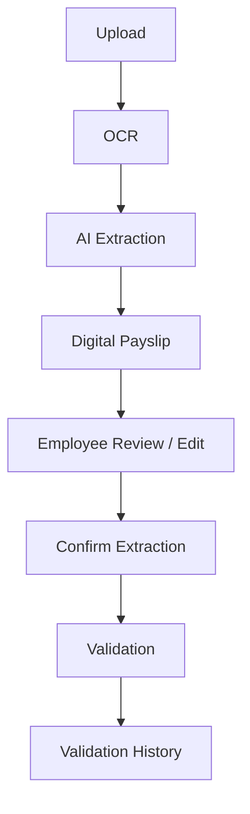

# Payroll Copilot

**A payroll validation platform for Israeli labor-law compliance, built around a deterministic rule engine.**

Payroll Copilot helps guests and employees upload payslips, reconstruct them as editable digital documents, and receive structured validation from a **deterministic backend rule engine**. AI assists with OCR, document reconstruction, explanations, and a source-bound payroll assistant — it never decides pass/fail.

> **Status: work in progress.** Guest landing, Employee monthly workspace (including salary analytics), Accountant portal (employees, bulk pipeline, org payroll + AI quality analytics), DynamoDB/S3 persistence, Cognito adapters, local Docker development, Admin organization census and quality dashboards, and developer AI monitoring (telemetry emit, CloudWatch historical read, System Dashboard trends, model comparison) are in place. Several capabilities remain partial or planned. See [Project status](#project-status).

---

## Table of contents

- [Business overview](#business-overview)
- [Architecture](#architecture)
- [Architecture decisions](#architecture-decisions)
- [Project structure](#project-structure)
- [Features](#features)
- [Employee Portal](#employee-portal)
- [Public Landing](#public-landing)
- [Accountant Portal](#accountant-portal)
- [Admin Portal](#admin-portal)
- [Analytics](#analytics)
- [AI, OCR, extraction, and validation](#ai-ocr-extraction-and-validation)
- [AI Observability and monitoring](#ai-observability-and-monitoring)
- [AWS](#aws)
- [DynamoDB](#dynamodb)
- [Storage](#storage)
- [Security](#security)
- [Docker and development setup](#docker-and-development-setup)
- [Configuration](#configuration)
- [API](#api)
- [Testing](#testing)
- [Project status](#project-status)
- [Documentation](#documentation)
- [Troubleshooting](#troubleshooting)

---

## Business overview

Payroll Copilot validates payroll against:

- Israeli labor law (YAML-configured, locally authoritative)
- Department-specific rule profiles (lawyers, interns, and similar)
- Company / organization parameters (where configured)
- Employment contracts and historical payroll (planned / partial)

### Target users

| Role | Capabilities today |
|------|-------------------|
| **Guest** | Upload a payslip without registration; review a Document Model; confirm; receive deterministic validation; chat with the Payroll Assistant |
| **Employee** | Authenticated monthly workspace: upload → extract → edit Digital Payslip → confirm → validate → history; Document Center for supporting files; **Salary Analytics** tab on My Payslips (net/gross by payroll month) |
| **Payroll accountant** | Employee master data, profile, bulk upload UI, batch pipeline, org **Payroll Analytics** and **AI Quality Analytics**, rules browse/edit (legacy routes), review queue, audit logs (pipeline wiring still incremental) |
| **Admin / developer** | System Dashboard (AI KPIs + historical trends), AI Models comparison, Organization census analytics, cross-org AI Quality Analytics, Document Lab and other lab screens (many lab pages are Vite DEV-only) |

### Document types

Payslips · Attendance reports · Employment agreements · Israeli ID · ID appendix · Employee master Excel · Bulk payslip PDFs

---

## Architecture

Modular monolith with Clean Architecture and Domain-Driven Design.

```
┌──────────────┐     ┌──────────────┐     ┌──────────────┐
│ Presentation │ ──▶ │ Application  │ ──▶ │   Domain     │
│   (FastAPI)  │     │  (Use Cases) │     │ (Entities +  │
└──────────────┘     └──────┬───────┘     │    Rules)    │
                            │             └──────────────┘
                            ▼
                     ┌──────────────┐
                     │Infrastructure│
                     │ DynamoDB · S3 · Cognito · OCR · AI · CloudWatch · Redis │
                     └──────────────┘
```

**Key principle:** The validation engine is deterministic. AI handles OCR, document reconstruction, explanations, and assistant orchestration — never compliance outcomes.

**Operational surfaces:** Business **Analytics** (on-demand rollups over existing document/extraction/validation SoT) and **AI Observability** (telemetry wrapper → process-local aggregates + CloudWatch custom metrics) sit beside the portals. They do not replace the rule engine and do not introduce a separate event warehouse.

| Concern | Choice |
|---------|--------|
| API | FastAPI (`/api/v1`) |
| Frontend | React + TypeScript + Vite |
| Primary DB | Amazon DynamoDB (single-table) |
| Objects | Amazon S3 (MinIO locally) |
| Identity | Amazon Cognito (dev role picker when Cognito unset) |
| LLM | Capability-routed OpenAI / Ollama / Bedrock behind `ModelProvider` + telemetry wrapper |
| Analytics | On-demand `AnalyticsService` + registry (no aggregation tables / jobs) |
| AI metrics history | CloudWatch GetMetricData when enabled; process-local hourly buckets as local/dev fallback |
| Workers | Celery + Redis |
| i18n | Hebrew / English / Arabic (RTL-aware) |

Authoritative architecture detail: [ARCHITECTURE.md](ARCHITECTURE.md). Analytics contracts: [docs/analytics.md](docs/analytics.md).

---

## Architecture decisions

| Decision | Why |
|----------|-----|
| **DynamoDB single-table** | Access-pattern–driven keys and GSIs fit multi-tenant payroll reads (employee months, document/extraction lookup, validation history) without joining across many tables. One table per environment keeps ops simple while entity types remain explicit via `entity_type`. |
| **S3 for documents** | Payslip binaries are large, versioned, and rarely queried as rows. Object storage keeps DynamoDB items small and lets encryption, versioning, and Block Public Access sit at the bucket boundary. |
| **Cognito for authentication** | Managed identity (email auth, verification, JWTs) without owning password storage. Application code still owns org scope, employee binding, and role authorization after the token is verified. |
| **Deterministic validation** | Compliance pass/fail must be auditable and repeatable. AI extracts and explains; the rule engine alone decides outcomes against versioned YAML rule packs. |
| **Evidence-first Document Model** | Extraction reconstructs what appears on the slip (dynamic fields/tables) before mapping to a Canonical Payroll Model. Review edits the Document Model; the rule engine only sees the post-confirm canonical mapping — preventing schema-first filtering from silently dropping evidence. |
| **On-demand analytics (no warehouse)** | Dashboards answer operational questions from existing documents, extractions, validation runs/findings, and employee bindings. Avoiding aggregation tables and cron jobs keeps a single source of truth and reduces drift risk while volume remains manageable. |
| **CloudWatch for AI historical metrics** | AI call telemetry is emitted as CloudWatch custom metrics for production history and multi-instance visibility. The UI reads GetMetricData when enabled and falls back to process-local hourly buckets for local/dev — without inventing a DynamoDB AI event store. |
| **Bedrock prepared, optional at runtime** | AWS region and provider adapters support managed inference when a capability is routed to `bedrock`. Local/Docker development commonly uses Ollama (and/or OpenAI) via capability-specific `*_PROVIDER` settings. |
| **Employee session in-memory cache** | Authenticated employee UI may reuse data already loaded in the current browser session (e.g. payroll month detail). The cache never fetches on its own, never persists to storage, clears on logout, and does not bypass backend authorization. |
| **Employee AI context boundary** | The authenticated Employee Chat inspects the frontend session inventory, then calls a dedicated employee-authorized endpoint. The backend derives the employee identity from authentication, loads only intent-required structured resources, sanitizes them, and appends that prepared context to the unchanged labor-law RAG context. Browser values and identifiers are never trusted as LLM context; Public Landing Chat remains on its existing endpoint. |

---

## Project structure

```
payroll-copilot/
├── README.md
├── ARCHITECTURE.md
├── .env.example / .env.docker.example / .env.local.example / .env.production.example
├── docker-compose.yml
├── docs/                          # Module docs (some still lag DynamoDB migration)
├── backend/
│   ├── pyproject.toml
│   ├── Dockerfile
│   ├── alembic/                   # Optional legacy PostgreSQL tooling only
│   ├── config/
│   │   ├── rules/labor_law/       # YAML legal rules (source of truth)
│   │   ├── rules/departments/
│   │   ├── prompts/
│   │   └── ai_models.yaml
│   ├── mcp/                       # Legal-rule sync tooling (foundation)
│   └── src/payroll_copilot/
│       ├── domain/
│       ├── application/           # Use cases, ports, services
│       ├── infrastructure/        # DynamoDB, S3, Cognito, OCR, AI, Celery
│       └── presentation/          # FastAPI routes
└── frontend/
    └── src/
        ├── app/                   # Routing
        ├── auth/                  # Cognito + dev auth
        ├── features/              # Guest landing, employee digital form, analytics kit, …
        ├── pages/                 # public / employee / accountant / admin
        ├── services/              # Typed API clients (incl. analytics, AI monitoring)
        ├── hooks/                 # Portal + analytics/monitoring resource hooks
        └── i18n/locales/          # en, he, ar
```

---

## Features

### Deterministic validation

- Rule evaluation, findings, confidence aggregation
- Persistence of validation runs and findings in DynamoDB
- Guest and employee validation entry points
- AI may explain findings; it does not change outcomes

### Document upload and object storage

- Guardrailed uploads (type/size)
- Bytes in S3 (or MinIO); metadata in DynamoDB
- Employee-owned keys under organization / employee prefixes

### OCR and payslip parsing

- Pluggable OCR (PaddleOCR default; Hebrew → Tesseract fallback)
- Embedded PDF text preferred when available
- Evidence-bound payslip / Document Model extraction via LLM (completeness of what appears on the slip before canonical mapping)
- Semantic validation and controlled retry (honest MISSING over invented values)
- Persisted extraction/OCR/validation statuses feed **AI Quality Analytics** without a separate quality store

### Portals

- Public landing (assistant + validate-my-payslip)
- Employee monthly payslip workspace (primary employee flow) + Salary Analytics on My Payslips
- Accountant portal (employees, bulk pipeline, org analytics)
- Admin System Dashboard, organization census, AI quality analytics, AI Models
- Admin / Document Lab for developers (many lab screens are Vite DEV-only)
- Developer AI monitoring (usage footer, dashboard KPIs, historical trends, model comparison)
- Global popular questions sidebar on landing chat (counters only; answers always live)

### Analytics (on-demand)

- Employee salary series (net/gross by payroll period)
- Accountant org payroll outcomes, validation failures, confidence
- Accountant / admin AI quality KPIs (extraction, OCR, validation, confidence distribution, manual review, failures)
- Admin organization census (companies, employees, accountant assignment coverage)
- Shared chart kit and loading / empty / error states across dashboards

### Auth

- Guest short-lived JWT for landing
- Cognito login / refresh when configured
- Dev role selector (`VITE_DEV_AUTH_ENABLED=true`) for local portals (employee / accountant / developer_admin sessions)
- Employee routes require Bearer auth + employee binding
- Accountant and admin analytics/monitoring routes enforce application-layer roles

---

## Employee Portal

Navigation (Employee Portal only):

1. **My Documents** (default home)
2. **My Payslips**
3. **Payroll AI Chat**

### My Documents

Workspace at `/employee/documents` with top-level document tabs:

- **ID Card**
- **ID Appendix**
- **Employment Contract**

Each document type uses the same inner structure as the payslip month workspace:

| Tab | Purpose |
|-----|---------|
| **Upload** | Select a file and run OCR/AI extraction (default language: Hebrew). Replacements require confirmation; the previous version remains active unless the new extraction and persistence succeed |
| **Digital Form** | ID Card and ID Appendix use fixed payroll fields (manual entry or extraction). Employment Contract keeps the dynamic extracted-field editor. All support explicit save |
| **Original Document** | Filename, upload date, type, status; delete original with confirmation. No embedded preview |

### My Payslips

Monthly list → workspace at `/employee/payslips/:year/:month`.

The My Payslips page also exposes a **Salary Analytics** tab: an on-demand chart of net and gross salary by `period_year` / `period_month` for the authenticated employee (see [Analytics](#analytics)). Payslips without a payroll period are excluded from the series and counted separately. This exists so employees can spot month-to-month pay changes without exporting data or relying on opaque AI summaries.

### End-to-end payslip workflow



Compact workspace timeline: **Upload → Extract → Review → Validate → Completed**.

### Payslip workspace tabs

| Tab | Purpose |
|-----|---------|
| **Upload** | Select/replace the payslip for the month; start extraction. Delete on this tab removes a *selected replacement*, not the confirmed original. |
| **Digital Payslip** | Editable **source of truth** after extraction. Field cards with typed previews, edit dialog, delete-with-confirm. Long values truncate in the grid. |
| **Validation** | Deterministic findings as compact cards; optional AI explanation per finding. Attendance validation is **out of scope** and not shown. |
| **Original Document** | Document management metadata (filename, upload date, type, status/size when available) and **Delete Original Document** with confirmation. No embedded PDF/image preview. |

### Digital Payslip as source of truth

- Extraction produces a structured field set stored as a versioned extraction.
- The Digital Payslip is what the employee reviews and edits.
- Edits are draft corrections until confirmation.
- **Run Validation** saves dirty fields, confirms the extraction, then runs the rule engine.
- After edits, previous validation runs are treated as **outdated** until re-validation.

### Extraction confirmation

- Confirmation is an explicit server-side step (`POST /extraction/employee/{document_id}/confirm`).
- National ID mismatch or payroll-period mismatch can **block** confirmation.
- Name-only mismatches are typically warnings, not hard blocks.
- Validation requires a confirmed extraction.

### Validation lifecycle

1. Confirm latest Digital Payslip (with acknowledgement).
2. `POST /validation/employee/run` creates a new validation run + findings in DynamoDB.
3. Results appear on the Validation tab and in month detail / history.
4. Re-validation after edits creates a **new** run; older runs remain for audit and may be flagged outdated.

### Other employee pages

| Page | Status |
|------|--------|
| My Documents workspace | Implemented (extract / persisted digital form / safe replacement / original document) |
| My Payslips / month workspace | Implemented |
| Payroll AI Chat | Implemented (authenticated endpoint; labor-law RAG + backend-authorized structured employee context; no document embeddings) |
| Attendance & Employment Contract nav items | Removed from Employee navigation (legacy routes redirect to My Documents) |

---

## Public Landing

Public `/` offers:

1. **Payroll Assistant** — `POST /assistant/chat` (LangGraph + guardrails + keyword search over approved YAML rules; safe Markdown rendering in UI).
2. **Validate My Payslip** — document-first guest flow:

```
Upload payslip
        ↓
OCR (embedded text first; OCR when needed)
        ↓
Complete Document Model (dynamic fields / tables)
        ↓
User review (edit / add / delete optional)
        ↓
Confirm → Canonical Payroll Model mapping
        ↓
Deterministic validation
        ↓
Optional AI explanation of findings
```

| Layer | Role |
|-------|------|
| **Document Model** | Source of truth for guest review — dynamic keys/values from *this* slip |
| **Canonical Payroll Model** | Built after confirmation for the rule engine only |

Guest extraction/session state is **ephemeral** (in-process TTL store), not the employee DynamoDB ownership model.

---

## Accountant Portal

Primary navigation under `/accountant`:

1. **Employees** — organization-scoped search and employee master data
2. **Bulk Upload** — persistent two-tab upload and incremental extracted-employee workspace
3. **Analytics** — organization payroll outcomes and AI quality KPIs by payroll year (see [Analytics](#analytics))

Opening an employee reuses the Employee Portal Documents, Payslips, monthly
workspace, validation, Digital Payslip, Original Document, and Payroll AI Chat
components. The frontend injects an accountant-selected workspace API; the
backend always resolves that employee by employee number inside the
authenticated accountant's organization before any read, edit, validation, or
AI context operation.

### Why Analytics sits in the accountant primary nav

Accountants need a month-level view of how the org’s payslip pipeline is behaving — volume processed, success vs review vs failed, validation failure hotspots, and extraction confidence — without opening every employee workspace. The **AI quality** tab answers a different question: whether OCR/parser/validation rates and manual-review pressure are degrading for a given payroll year. Both views are computed on demand from existing SoT so accountants do not maintain a second reporting database.

Bulk batch state lives above routes, so progress, results, filters, and scroll
position survive tab changes and employee-workspace navigation. Redis-backed
job state allows processing to continue without an open browser. The worker
splits payroll packages into one independent payslip document per page, then
processes each page sequentially through the shared OCR/parser, Digital Payslip
persistence, employee matching, and deterministic validation use cases.
National ID matching runs first, with employee number as a fallback. Every
split PDF, OCR result, extraction version, validation run, review state, and
processing correlation is persisted before the worker starts the next page.

Batch payslips are accountant-review drafts. A provisional employee match lets
the accountant reuse the existing Digital Payslip, Validation, Original
Document, and Payroll AI Chat workspace, but `publication_status=draft` is a
hard Employee Portal visibility boundary. Corrections create extraction
versions; every revalidation creates another immutable validation run displayed
in validation history. Only **Approve & Publish**, after the current extraction
has been confirmed and validated, changes the document to employee-visible.

Legacy accountant pages (rules, findings, approvals, audit, batch monitor) remain
routable but are intentionally not in the Phase 1 primary navigation.

One payslip failure is isolated to that item and does not stop the batch.
Unknown-employee resolution can correct the extracted National ID or attach a
selected employee, then resumes the same persisted draft without repeating OCR.
Progress currently reaches the browser by polling Redis-backed job state; the UI
contract does not depend on polling and can later move to push events.

---

## Admin Portal

Developer-admin surfaces under `/admin` (role: `developer_admin` / `UserRole.ADMIN`).

### Primary production navigation

| Path | Purpose | Operational decisions it supports |
|------|---------|-----------------------------------|
| `/admin` | **System Dashboard** — AI usage KPIs, capability breakdown, historical trend charts, provider comparison for the selected window | Detect cost/latency/error spikes; see whether retries/fallbacks are rising; confirm which providers/capabilities drive traffic |
| `/admin/analytics` | **Organization Analytics** — census of companies, employees, payroll accountants, unassigned employees | Capacity and assignment coverage across tenants |
| `/admin/analytics/quality` | **AI Quality Analytics** — cross-org rollup of extraction/OCR/validation/confidence/review metrics | Compare quality pressure across organizations for a payroll year |
| `/admin/ai-models` | **AI Models** — per provider/model operational comparison (requests, latency, tokens, cost, success/error/retry/fallback rates) | Choose which models to keep routing to; spot underperforming combinations |

### Why these dashboards exist separately from portal analytics

- **Census / quality analytics** answer *business and pipeline quality* questions from DynamoDB document/validation SoT (same Analytics platform as accountant/employee).
- **System Dashboard / AI Models** answer *LLM ops* questions from the telemetry pipeline (process aggregates + CloudWatch). Mixing them would conflate “was this payslip validated correctly?” with “did the provider call fail or get expensive?”

### DEV-only lab screens

When the frontend is built with Vite DEV mode, additional admin routes remain available for engineering (users/roles, rule packs, department rules, MCP sync, RAG management, system configuration, audit logs, Document Lab). These are intentionally omitted from production builds so unfinished lab UIs are not exposed.

---

## Analytics

Payroll Copilot’s **Analytics** vertical is an on-demand query layer over existing persistence. It does **not** introduce aggregation tables, cache jobs, or a second warehouse.

### Why this architecture

| Goal | Approach |
|------|----------|
| Single source of truth | Metrics are derived from documents, extractions, validation runs/findings, employees, and user bindings already written by the product flows |
| Low regression risk | New metrics register as use cases on `AnalyticsService` / `AnalyticsRegistry` instead of forking parallel reporting code |
| Auditable periods | Series group **only** by document `period_year` / `period_month` (never upload `created_at`) so charts match payroll months |
| Role-appropriate views | Employee sees own salary; accountant sees org payroll + quality; admin sees census + cross-org quality |

Contract detail: [docs/analytics.md](docs/analytics.md).

### Backend shape

| Component | Role |
|-----------|------|
| `AnalyticsService` | Facade over registered metric providers; `run_metric` extension point |
| Use cases | `employee.salary`, `org.payroll`, `org.quality`, `admin.census`, `admin.quality` |
| Helpers | Period keys, salary value extraction, document outcome classification, confidence buckets, aggregation |

### APIs (`/api/v1/analytics`)

| Endpoint | Auth | What it returns |
|----------|------|-----------------|
| `GET /employee/salary` | Bound employee | Net/gross by payroll month for one employee |
| `GET /org/payroll` | Payroll accountant (org-bound) | Documents by outcome, validation failures, error-type distribution, average confidence by month |
| `GET /org/quality` | Payroll accountant (org-bound) | Extraction/OCR/validation success rates, confidence distribution, manual review, failed documents |
| `GET /admin/census` | Developer admin | Companies, employees, payroll accountants, assignment coverage, per-org slices |
| `GET /admin/quality` | Developer admin | Cross-org rollup of `org.quality` for a payroll year |

### Frontend surfaces

| Surface | Location | Charts / KPIs | Decisions supported |
|---------|----------|---------------|---------------------|
| **Employee Salary Analytics** | My Payslips → Salary Analytics tab | Net/gross line/bar by month; year filter; empty/error states | Spot unexpected pay changes; confirm months with published slips |
| **Accountant Payroll Analytics** | `/accountant/analytics` → Payroll outcomes tab | Processed volume, success/review/failed, validation failures, top error types, confidence trend | Prioritize review load; find failing rule hotspots; watch confidence drift |
| **Accountant AI Quality Analytics** | Same page → AI quality tab | Extraction/validation success rates, OCR success vs fail, manual review rate, failed documents, confidence histogram | Decide whether OCR/parser quality needs ops attention before payroll close |
| **Admin Organization Analytics** | `/admin/analytics` | Census KPIs, employees-per-accountant bars, per-org table | Staffing and assignment gaps across tenants |
| **Admin AI Quality Analytics** | `/admin/analytics/quality` | Same quality KPIs rolled up across organizations | Compare org quality; escalate systemic extraction issues |

Shared UI building blocks live under `frontend/src/features/analytics/` (dashboard layout, stat cards, year filter, loading/empty/error states, Recharts wrappers).

### Quality metric definitions (existing SoT only)

| Metric | Source of truth |
|--------|-----------------|
| Extraction success | Latest extraction `ocr_status` + `parser_status` both `completed` |
| OCR success / failure | Latest extraction `ocr_status` |
| Validation success | Latest validation run `overall_result == pass` |
| Average confidence | Extraction `overall_confidence`, else validation run |
| Confidence distribution | Fixed bands `0–0.5`, `0.5–0.7`, `0.7–0.85`, `0.85–1.0` |
| Manual review | Document outcome / lifecycle / confirmation review (not the Redis employee-match queue) |
| Failed documents | Document outcome classification → failed |

Metrics that would require new persistence (e.g. processing duration histograms, Redis match-queue depth as “quality”) are intentionally out of this vertical.

### Document pipeline relationship

```
Upload → OCR evidence → Document Model / Digital Payslip
        → Confirm → Canonical mapping → Deterministic validation
                ↘
                  Analytics reads the same persisted documents,
                  extractions, and validation runs on demand
```

Analytics never writes pipeline state; it only aggregates what product flows already stored.

---

## AI, OCR, extraction, and validation

### Model providers

| Provider | Status |
|----------|--------|
| **Ollama** | Supported — local / Docker development |
| **OpenAI** | Supported — cloud chat/embeddings when configured |
| **Amazon Bedrock** | Supported — managed inference when configured |

Providers are selected per AI capability (`PAYSLIP_EXTRACTION_PROVIDER`, `ASSISTANT_PROVIDER`, …) with fallback to `MODEL_PROVIDER`. Every completion passes through a **telemetry wrapper** (`TelemetryModelProvider`) that normalizes prompt/completion/total tokens, estimates cost, measures latency, and records retry/fallback flags and capability tags for monitoring.

### OCR

- Port + factory; default `OCR_PROVIDER=paddleocr`
- Hebrew: intentional Tesseract fallback (PaddleOCR has no official Hebrew model)
- Preprocessing, language mapping, layout words/bboxes, multi-PSM Tesseract selection
- Guest/employee interactive flows use sync extraction endpoints (background Celery OCR on generic upload remains limited)

### Extraction

- Evidence-bound parsing with semantic checks and one controlled retry
- Guest: complete Document Model → confirm → canonical mapping
- Employee: owned extract → Digital Payslip → confirm → validate
- Corrections create new extraction versions
- Capability tagging (e.g. payslip extraction, assistant, RAG) flows into telemetry for ops breakdowns

### Validation

- Deterministic Python rule engine + YAML labor-law packs
- Findings and confidence from backend only
- Scope honestly reports `partial` / `not_available` for unwired areas (contract, attendance analysis, historical comparison, vector RAG)

### Assistant

- Orchestrator only; source-bound answers from approved YAML
- No vector RAG yet
- Graceful degradation if the LLM is unreachable
- Optional usage footer on chat responses (same contract for all providers)
- Global popular-question counters for the landing sidebar

---

## AI Observability and monitoring

AI Observability extends the existing developer AI Monitoring platform. It answers **ops** questions (cost, latency, reliability, provider/model mix) — distinct from **AI Quality Analytics**, which answers pipeline-quality questions from document SoT.

### What it does

| Capability | Behavior |
|------------|----------|
| **Emit** | Every routed LLM call records tokens, estimated cost, latency, success/error, retry, fallback, provider, model, capability |
| **Process-local store** | Always updates in-process aggregates + hourly buckets (local/dev trends; lost on process restart) |
| **CloudWatch emit** | When `CLOUDWATCH_ENABLED=true`, PutMetricData under `CLOUDWATCH_METRICS_NAMESPACE` (default `PayrollCopilot`) with dimensions Provider / Model / Capability |
| **CloudWatch read** | `GET /admin/ai/history` uses GetMetricData (SEARCH + aggregate) for historical series and provider slices when CloudWatch is available |
| **Fallback** | If CloudWatch is disabled, unreachable, or returns an empty window while local samples exist, history uses real process-local hourly buckets — never fabricated datapoints |

### Why CloudWatch (not a DynamoDB event store)

Production AI traffic may span multiple API instances. Process-local counters alone cannot answer “what happened across the fleet last 72 hours?” CloudWatch already receives custom metrics for alarms/ops; reading those metrics reuses the emit path without duplicating every call into DynamoDB. Local development keeps working when AWS credentials or metrics are absent.

### Surfaces

| Surface | What it shows | Decisions supported |
|---------|---------------|---------------------|
| Conversation **usage footer** | Provider, model, tokens, estimated cost, latency, retry, fallback under each Q→A | Spot expensive or slow turns during product use |
| `/admin` **System Dashboard** | Snapshot KPIs; tokens by provider/model/capability; optional prompt-version counts when callers set them; trend charts (tokens, cost, latency, success/error/retry/fallback); provider comparison for the selected window | Investigate regressions; compare providers; watch retry/fallback pressure |
| `/admin/ai-models` **AI Models** | Table + chart: requests, avg latency/tokens, cost, success/error/retry/fallback rates, capability | Decide routing and model retention |
| Landing **popular questions** | Top 10 global questions by ask count (no answer cache; click re-asks the LLM) | Content prioritization for labor-law FAQ coverage |

### APIs (`/api/v1/admin/ai`)

| Endpoint | Purpose |
|----------|---------|
| `GET /dashboard?window_hours=` | KPI snapshot (`source` indicates process_local for this aggregate) |
| `GET /models/comparison?window_hours=` | Per provider/model operational rows |
| `GET /history?window_hours=` | Time series + `by_provider` + `source` (`cloudwatch` or `process_local`) |

Auth: developer admin only.

### Prompt version

`prompt_version` is plumbed through `AICallContext` / usage stats and counted in process-local aggregates **when callers set it**. It is not currently emitted as a CloudWatch dimension (avoids changing the historical metric schema). Dashboards show prompt-version bars only when non-empty counts exist.

### Production considerations

- Dashboard snapshot KPIs remain process-local for low latency; use **history** for multi-instance CloudWatch trends.
- Metric emit failures never break AI calls (swallowed with debug logging).
- Retry rates reflect `AICallContext.retry_count`; production paths that do not increment the context will under-report retries.
- **AI Quality Analytics** (document extraction/validation rates) remains under `/analytics` and `/admin/analytics/quality` — do not confuse with this ops telemetry.

---

## AWS

### Infrastructure-first approach

AWS foundations were prepared **before** full application cutover: region, private storage, identity, and IAM for local/dev access. The application then integrated against those boundaries (DynamoDB adapters, S3 storage, Cognito auth).

**Region:** `us-east-1` — selected so future Amazon Bedrock integration can use models available in that region, alongside the rest of the AWS footprint.

### AWS services

| Service | Purpose | Current status |
|---------|---------|----------------|
| **Amazon Cognito** | User Pool authentication (email), JWT verification | In use when `COGNITO_*` is configured; local/dev may use the role picker |
| **Amazon DynamoDB** | Primary business database (single-table) | In use (DynamoDB Local in Compose) |
| **Amazon S3** | Private document object storage | In use (MinIO locally) |
| **IAM** | Least-privilege roles; development user / access keys for local AWS access | In use |
| **Amazon Bedrock** | Managed LLM inference | In use when a capability routes to `bedrock` |
| **Amazon SES** | Outbound email | Adapter present; console fallback when unset |
| **CloudWatch** | Logs + AI custom metrics (PutMetricData emit + GetMetricData history for admin dashboards) | Configured; telemetry emits when `CLOUDWATCH_ENABLED=true`; history API reads when reachable and falls back to process-local hourly buckets |

### Storage posture (S3)

- Private bucket
- Block Public Access
- Server-side encryption
- Versioning enabled (production bucket configuration)

### Identity posture (Cognito)

- Cognito User Pool for production authentication
- Email-based sign-in / verification policies on the pool
- **Business roles** (employee, payroll accountant, admin) are enforced in the **application layer** after identity is established (groups/claims are mapped; fine-grained org/employee binding is app-owned)

### Local development credentials

- IAM development user + AWS access keys may be used to call real AWS APIs from a developer machine when not using Local/MinIO substitutes
- Docker Compose defaults to DynamoDB Local + MinIO so day-to-day work does not require live AWS

---

## DynamoDB

**Primary runtime database.** One application table per environment (default name `PayrollCopilot`).

PostgreSQL / Alembic remain in the repo only as **optional legacy tooling** (`docker compose --profile legacy-postgres`). They are not part of the active runtime path.

### Single-table design

- Every item has `PK` and `SK` (plus `entity_type`, and usually `organization_id` / timestamps)
- Access patterns drive key design
- Sparse GSIs for alternate lookups
- Document **bytes** stay in S3; DynamoDB stores metadata and structured business state

### Global Secondary Indexes

| Index | Partition Key | Sort Key |
| ----- | ------------- | -------- |
| GSI1 | GSI1PK | GSI1SK |
| GSI2 | GSI2PK | GSI2SK |
| GSI3 | GSI3PK | GSI3SK |

**Typical usage in code today:**

| Index | Examples |
|-------|----------|
| **GSI1** | Lookup by document / extraction / validation-run / employee / user / department id |
| **GSI2** | Employee number within an organization |
| **GSI3** | National ID hash within an organization; dataset-scoped document/audit queries |

### Entity types currently stored

| Entity | `entity_type` | What it stores |
|--------|---------------|----------------|
| **Organization** | `organization` | Tenant metadata |
| **Department** | `department` | Org unit + rule profile |
| **Employee** | `employee` | Employee master data |
| **User binding** | `user_binding` | Auth subject → org / role / employee |
| **Document** | `document` | File metadata, S3 key, period, lifecycle; month workspace pointers live here (no separate workspace entity) |
| **Extraction** | `extraction` | Versioned Digital Payslip fields + confirmation state |
| **Validation run** | `validation_run` | One deterministic rule-engine execution |
| **Validation finding** | `validation_finding` | Findings belonging to a run |
| **Audit log** | `audit_event` | Sensitive-action audit trail |

Also present for seeding/tooling: `dataset_employee`.

### Access patterns (summary)

| Pattern | Approach |
|---------|----------|
| List employee documents / months | Query `PK = ORG#…#EMP#…`, `SK begins_with DOC#` |
| Get document / extraction / run by id | GSI1 |
| Resolve user binding | `USER#…` under org + GSI1 |
| Find employee by number / national ID | GSI2 / GSI3 |
| Validation history | Query `VALRUN#` under employee partition |
| Org audit | Query `AUDIT#` under org |

Guest landing sessions use an **in-process ephemeral store**, not durable DynamoDB guest items (by design today).

**Analytics and AI monitoring** do not add analytics-specific DynamoDB entities. Business analytics query existing document/extraction/validation/employee items on demand. AI Observability emits/reads CloudWatch custom metrics (plus process-local aggregates) rather than writing per-call event rows.

Deeper design notes: [ARCHITECTURE.md](ARCHITECTURE.md) § DynamoDB. Module doc [docs/database.md](docs/database.md) still contains legacy PostgreSQL material and should be treated carefully until refreshed.

---

## Storage

| Environment | Objects | Metadata |
|-------------|---------|----------|
| Production | Amazon S3 | DynamoDB |
| Docker / local | MinIO (`S3_ENDPOINT`) | DynamoDB Local |

Employee uploads use logical keys under `organizations/{org}/employees/{emp}/…` (including period paths for payslips). File bytes are never stored in the database.

---

## Security

- Cognito JWTs when configured; guest JWT for landing; employee routes require Bearer + binding
- Application-layer RBAC and organization scoping (Cognito groups alone are insufficient)
- Analytics and AI monitoring endpoints reuse the same auth principals: bound employee, org-bound accountant, or developer admin — no separate auth system
- Encrypted National ID at rest; API returns masked ID only
- Upload guardrails; tenant isolation on employee-owned documents
- Append-only audit events for sensitive employee/accountant actions
- Do not rely on frontend route protection alone for ownership checks

See [docs/security-and-deployment.md](docs/security-and-deployment.md).

---

## Docker and development setup

### Prerequisites

- Docker & Docker Compose v2.20+
- Optional host tooling: Python 3.12+, Node.js 20+
- 16GB+ RAM recommended when using local Ollama

### Primary startup

```powershell
copy .env.docker.example .env
docker compose up --build
```

| URL | Purpose |
|-----|---------|
| http://localhost:3000 | Frontend (Vite hot reload) |
| http://localhost:8000/docs | OpenAPI / Swagger |
| http://localhost:8000/health | API health |
| http://localhost:9001 | MinIO console |

### Compose architecture

```
payroll_net
├── dynamodb          # DynamoDB Local (primary persistence)
├── redis             # Celery broker / cache
├── minio             # S3-compatible object store
├── api               # FastAPI :8000
├── worker            # Celery worker
├── beat              # Celery beat
├── frontend          # Vite :3000
├── postgres          # profile: legacy-postgres (optional)
├── migrate           # profile: legacy-postgres
├── ollama            # profile: docker-ollama (optional local LLM)
└── n8n               # profile: automation (optional)
```

Startup order: Redis healthy + DynamoDB/MinIO up → API / worker / beat → frontend (waits for API healthy).

### Important: frontend `node_modules` volume

The Compose `frontend` service mounts a **named volume** `frontend_node_modules` over `/app/node_modules`.

If `frontend/package.json` or `frontend/package-lock.json` change (for example after adding an npm package):

```powershell
docker compose down -v
docker compose up --build
```

**Why:** recreating containers **without** removing volumes keeps the old `node_modules` volume. New packages will not appear inside the container until that volume is recreated. Use `down -v` when dependencies change; avoid casual `-v` otherwise (it also wipes Redis/MinIO/Ollama data volumes).

### Environment files

| File | Role |
|------|------|
| `.env.docker.example` → `.env` | Docker development (DynamoDB Local, MinIO, Ollama) |
| `.env.local.example` → `.env.local` | Host-local API against localhost infra |
| `.env.production.example` / `.env.example` | AWS-oriented defaults (S3, DynamoDB, Cognito; Bedrock keys reserved for a later phase) |
| `frontend/.env.example` | Vite; set `VITE_DEV_AUTH_ENABLED=false` for Cognito UI |

### Dev auth roles

When `VITE_DEV_AUTH_ENABLED=true` (Compose frontend default):

| Role | Portal |
|------|--------|
| `employee` | `/employee` |
| `payroll_accountant` | `/accountant` |
| `developer_admin` | `/admin` |

Local session helpers: `POST /auth/dev/employee-session`, `/auth/dev/accountant-session`, `/auth/dev/admin-session` (blocked when Cognito is configured or `APP_ENV` is production).

### Optional host development

```powershell
docker compose up -d redis dynamodb minio
# then run uvicorn / celery / npm on the host against localhost endpoints
```

### AI provider routing

- Each AI capability selects `ollama`, `openai`, or `bedrock` independently.
- Capability variables fall back to legacy `MODEL_PROVIDER` when omitted.
- The supplied examples route extraction to OpenAI GPT-5 and chats/RAG to Ollama.
- Prefer host Ollama; optional `--profile docker-ollama`
- URL resolution probes local → host gateway → Docker service (see `ollama_resolver.py`)

```bash
ollama pull mistral-nemo:12b
```

### Developer Document Lab

Admin-only debugger (`/admin/document-lab`) for OCR → parser → validation on fixtures. Enabled only when `APP_ENV` is development-like or `DEBUG=true`.

### Developer AI monitoring

- System Dashboard (`/admin`) — token/cost/latency/reliability KPIs, capability breakdown, historical trend charts, provider comparison
- AI Models (`/admin/ai-models`) — operational comparison table + reliability chart
- APIs: `GET /admin/ai/dashboard`, `GET /admin/ai/models/comparison`, `GET /admin/ai/history` (developer admin role)
- Popular questions: `GET /assistant/popular-questions`
- With CloudWatch enabled in AWS environments, history prefers GetMetricData; local Compose typically falls back to process-local hourly samples when metrics are empty or unreachable

---

## Configuration

| Variable | Description |
|----------|-------------|
| `AWS_REGION` | Shared region hint (`us-east-1`) |
| `DYNAMODB_TABLE_NAME` | Single-table name (`PayrollCopilot`) |
| `DYNAMODB_ENDPOINT` | Empty = AWS; set for DynamoDB Local |
| `DYNAMODB_AUTO_CREATE_TABLE` | `true` locally; `false` in production |
| `S3_ENDPOINT` / `S3_BUCKET` / `S3_REGION` | Object storage |
| `COGNITO_USER_POOL_ID` / `COGNITO_APP_CLIENT_ID` | Cognito auth |
| `MODEL_PROVIDER` | Backward-compatible fallback provider |
| `*_PROVIDER` | Capability route, e.g. `PAYSLIP_EXTRACTION_PROVIDER=openai` |
| `OPENAI_API_KEY` / `OPENAI_MODEL` | OpenAI credentials and default chat model |
| `BEDROCK_MODEL_ID` | Bedrock model used when a capability routes to Bedrock |
| `OCR_PROVIDER` | `paddleocr` (default) or tesseract path |
| `REDIS_URL` | Celery / cache |
| `JWT_SECRET_KEY` | Guest JWT signing |
| `ENCRYPTION_KEY` | PII encryption |
| `DEFAULT_LOCALE` | `he` |
| `CLOUDWATCH_ENABLED` | Emit (and attempt to read) AI custom metrics |
| `CLOUDWATCH_METRICS_NAMESPACE` | Custom metrics namespace (default `PayrollCopilot`) |
| `CLOUDWATCH_LOG_GROUP` | Log group name for platform log shipping |
| `DATABASE_URL` | Optional legacy Postgres only |

Full lists: `.env.production.example`, `.env.docker.example`.

---

## API

REST under `/api/v1`. Interactive docs: `/docs`.

Selected endpoints:

| Area | Endpoints |
|------|-----------|
| Auth | `POST /auth/login`, `/auth/refresh`, `/auth/guest/session`, `/auth/dev/employee-session`, `/auth/dev/accountant-session`, `/auth/dev/admin-session` |
| Employee | `GET /employees/me`, payslips / payroll-months, document center, finding explanations |
| Documents | `POST /documents/upload`, `POST /documents/employee/upload` |
| Extraction | Guest + employee payslip-extract / corrections / confirm |
| Validation | `POST /validation/run`, `POST /validation/employee/run`, run fetch |
| Assistant | `POST /assistant/chat`, `GET /assistant/popular-questions` |
| Analytics | `GET /analytics/employee/salary`, `/org/payroll`, `/org/quality`, `/admin/census`, `/admin/quality` |
| AI monitoring | `GET /admin/ai/dashboard`, `/admin/ai/models/comparison`, `/admin/ai/history` |
| OCR / parser | `POST /ocr/extract`, `POST /parser/payslip` |
| Batch / compliance | Bulk payslip jobs, MCP diff proposals (foundation) |

See [docs/api.md](docs/api.md) and [docs/analytics.md](docs/analytics.md).

---

## Testing

```powershell
# Backend
cd backend
$env:PYTHONPATH="src"
pytest
ruff check src tests
mypy src

# Frontend
cd frontend
npm test
npm run build
```

Relevant suites include unit/integration coverage for analytics (salary, org payroll, quality, auth gates), AI telemetry/observability (emit, local history, CloudWatch reader fallback), guest/employee extraction flows, and frontend chart-series / API client tests for analytics and AI monitoring.

Smoke: `GET /health`, guest assistant chat, document upload, guest/employee extract → confirm → validate, accountant/admin analytics endpoints (auth required), admin AI dashboard/history (auth required).

---

## Project status

### Implemented

- Deterministic validation engine + DynamoDB persistence for runs/findings
- Document upload to S3/MinIO with DynamoDB metadata
- OCR + evidence-bound payslip / Document Model extraction
- Guest landing: assistant + validate-my-payslip (document-first)
- Employee monthly workspace (Upload / Digital Payslip / Validation / Original Document)
- Employee identity/period comparison, confirmation gate, owned validation, re-validation after edits
- Employee Salary Analytics (net/gross by payroll month on My Payslips)
- Accountant Phase 1 workspace (organization-scoped employees, reused employee workspaces and selected-employee AI, persistent bulk UX)
- Accountant bulk pipeline (split → OCR → canonical extraction → match → confirm → deterministic validation, persisted incrementally)
- Accountant Analytics (org payroll outcomes + AI quality KPIs)
- Admin Organization census analytics + cross-org AI Quality Analytics
- Cognito adapter (login/refresh/JWT verify) + local dev auth (employee / accountant / admin sessions)
- DynamoDB single-table repositories (org, employee, documents, extractions, validation, audit, bindings)
- i18n (he / en / ar) with RTL
- Docker Compose development stack
- AI telemetry wrapper (normalized tokens/cost/latency/capability) and developer monitoring UI
- AI Observability history (`/admin/ai/history`) with CloudWatch GetMetricData when available and process-local hourly fallback
- System Dashboard trend charts and provider comparison; AI Models reliability comparison
- Global popular questions (DynamoDB counters + landing sidebar)

### In progress / partial

- Supporting document analysis (attendance / contract / national ID structured extract)
- Full RBAC enforcement on every accountant/guest mutation route
- SES delivery in real environments (console fallback when unset)
- Background Celery OCR on generic upload (interactive flows use sync extraction)
- Prompt-version population on all AI call sites (plumbing exists; CloudWatch dimension not emitted)
- Retry-context instrumentation completeness (rates under-report when callers omit `retry_count`)

### Planned

- Vector RAG over legal rules and contracts
- Historical payroll comparison / richer employee trends beyond current salary series
- Absolute uniqueness constraints beyond application-level period gates
- MCP Kol Zchut sync automation in production
- In-app binary document viewer for side-by-side review
- Stronger guest session durability (replace process-local ephemeral store if product requires it)
- WebSocket batch progress, mobile app, payroll-system integrations, SOC 2 — product roadmap items

---

## Documentation

| Document | Description |
|----------|-------------|
| [ARCHITECTURE.md](ARCHITECTURE.md) | System architecture (DynamoDB, AWS, auth) — preferred source of truth |
| [docs/analytics.md](docs/analytics.md) | Analytics API contracts (salary, org payroll, quality, census) |
| [docs/architecture.md](docs/architecture.md) | Older architecture notes (may lag) |
| [docs/database.md](docs/database.md) | DB notes — still contains legacy PostgreSQL material |
| [docs/ai-architecture.md](docs/ai-architecture.md) | AI / OCR / agents |
| [docs/rule-engine.md](docs/rule-engine.md) | Deterministic rules |
| [docs/api.md](docs/api.md) | API reference |
| [docs/security-and-deployment.md](docs/security-and-deployment.md) | Security & deployment |
| [backend/README.md](backend/README.md) | Backend package notes (may still mention legacy Postgres tooling) |

---

## Troubleshooting

| Symptom | Likely cause | Fix |
|---------|--------------|-----|
| Frontend cannot reach API | API not running | `docker compose up` or start uvicorn |
| `getaddrinfo` for `redis` / `minio` / `dynamodb` on host | Docker hostnames from host process | Use `.env.local` localhost URLs or `*_LOCAL_URL` fallbacks |
| New npm package missing in Docker frontend | Stale `frontend_node_modules` volume | `docker compose down -v` then `up --build` |
| Upload `background_status: not_queued` | Redis/Celery down | Document still stored; start worker for background jobs |
| Assistant limited / unavailable | Ollama unreachable | Start host Ollama and pull `OLLAMA_DEFAULT_MODEL` |
| Hebrew OCR uses Tesseract | Expected with PaddleOCR default | Not a bug — intentional fallback |

---

## Internationalization

Supported UI languages: **Hebrew (`he`, RTL)**, **English (`en`, LTR)**, **Arabic (`ar`, RTL)**. Default: `he`.

Locale packs live under `frontend/src/i18n/locales/`. The API accepts `Accept-Language` / explicit `locale` on relevant requests. OCR quality still depends on image quality and model availability.
